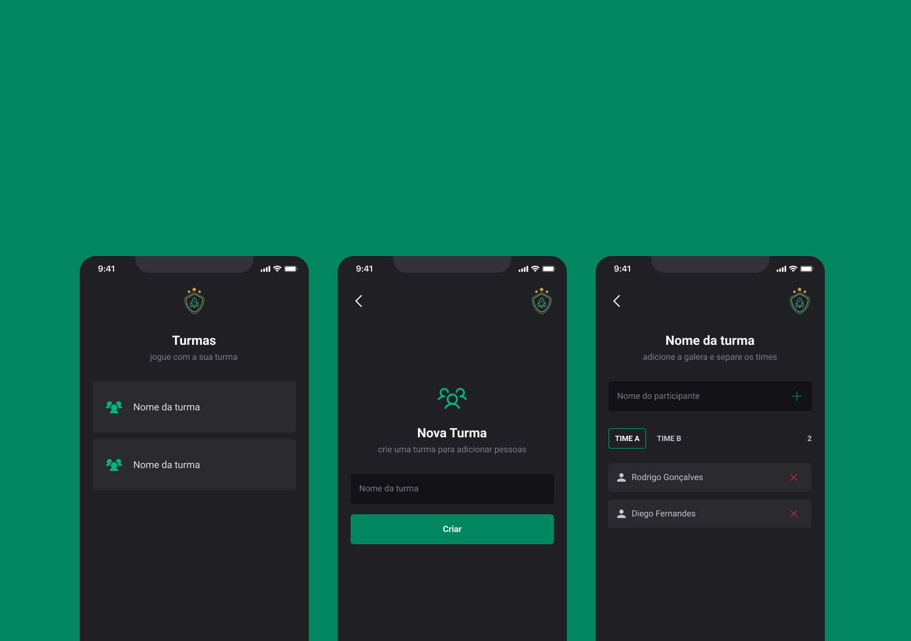

# INVITE TEAMS

Uma aplicação para criar e dividir times para uma jogatina com os amigos

### Stack e bibliotecas utilizadas

- TypeScript
- React Native
- React navigation - Native Stack
- Styled Components
- phosphor-react-native
- async storage
- react-native-toast-message
- alias de sessções como (screens, routes, components)
- gerar e tratar exceções

### Protótipo

